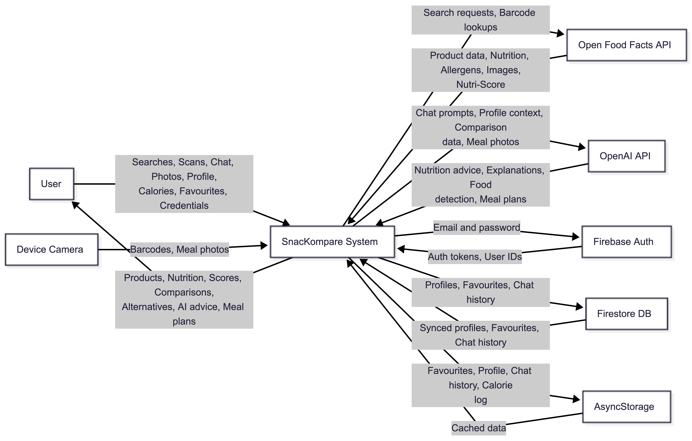
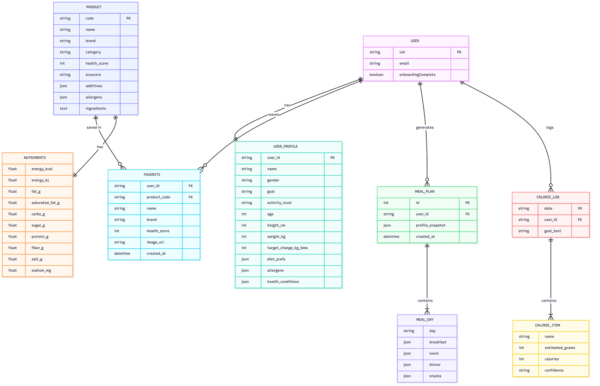

# Technical Specifation: Snackompare

## 0. Table of Contents

| Section | Title |
|--------|-------|
| 0 | [Table of Contents](#0-table-of-contents) |
| 1 | [Introduction](#1-introduction) |
| 1.1 | [Overview](#11-overview) |
| 1.2 | [Glossary](#12-glossary) |
| 2 | [System Architecture](#2-system-architecture) |
| 3 | [High-Level Design](#3-high-level-design) |
| 3.1 | [Authentication and User State](#authentication-and-user-state) |
| 3.2 | [Nutrition Processing and Health Scoring](#nutrition-processing-and-health-scoring) |
| 3.3 | [Comparison and Alternatives](#comparison-and-alternatives) |
| 3.4 | [AI Services Layer](#ai-services-layer) |
| 3.5 | [Calorie Tracking and Personalisation](#calorie-tracking-and-personalisation) |
| 3.6 | [Favourites and Saved Items](#favourites-and-saved-items) |
| 4 | [Problems and Resolution](#4-problems-and-resolution) |
| 4.1 | [Broken Pipe Error and Deploying on Railway](#41-broken-pipe-error-and-deploying-on-railway) |
| 4.2 | [Synchronisation Issues Between Devices](#42-synchronisation-issues-between-devices-asyncstorage--firestore) |
| 4.3 | [Async State Persistence Between Accounts](#43-async-state-persistence-between-accounts) |
| 4.4 | [Slow Loading Times When Searching Open Food Facts](#44-slow-loading-times-when-searching-open-food-facts) |
| 4.5 | [User Testing Challenges](#45-user-testing-challenges) |
| 5 | [Installation Guide](#5-installation-guide) |
| 5.1 | [Requirements](#51-requirements) |
| 5.1.1 | [Required Software](#required-software) |
| 5.1.2 | [Mobile Emulator Requirements](#mobile-emulator-requirements) |
| 5.1.3 | [Minimum Hardware Requirements](#minimum-hardware-requirements) |
| 5.2 | [Backend Server Setup](#52-backend-server-setup) |
| 5.3 | [External Services and Verification](#external-services-and-verification) |
| 5.4 | [External Services and Verification](#54-external-services-and-verification) |
| 5.5 | [Verification Steps](#verification-steps) |
| 5.6 | [Troubleshooting](#troubleshooting) |
| 6 | [Testing](#6-testing) |
| 6.1 | [Backend Testing](#61-backend-testing) |
| 6.2 | [Frontend Testing](#62-frontend-testing) |
| 7 | [User Testing](#7-user-testing) |
| 7.1 | [Findings](#71-our-findings) |
| 7.2 | [What we changed](#72-what-we-changed) |
| 7.3 | [Conclusion](#73-conclusion) |
| 8 | [References](#8-references) |

---

## 1. Introduction

### 1.1 Overview

Snackompare is an iOS mobile application developed using React Native, with a Django REST Framework backend hosted on Railway. The app allows users to scan barcodes or search for products to view nutritional information and health scores based on the European Nutri-Score system, and compare items with healthier alternatives. It also includes AI-powered calorie estimation from food images, a personalized chatbot, and a calorie tracking feature. Product nutrition and barcode data are sourced from Open Food Facts. User authentication, account management, and data storage are handled using Firebase services, with secure communication between the mobile client and backend via RESTful APIs. 

### 1.2 Glossary

| Term | Definition |
|------|------------|
| React Native | An open-source mobile application framework developed by Meta that allows developers to build cross-platform mobile applications using JavaScript and React. |
| Open Food Facts | An open, collaborative food database that provides product information such as ingredients, nutrition values, allergens, and barcodes through a public API. |
| Django REST Framework (DRF) | A Python framework used to build RESTful APIs. It provides tools for handling HTTP requests, serializing data, and exposing backend functionality to the mobile application. |
| RESTful API | An interface that allows communication between the mobile frontend and backend over HTTP using standard methods such as GET and POST, with data exchanged in JSON format. |
| Railway | A cloud hosting platform used to deploy and run the Django backend, making the API accessible over the internet. |
| Firebase | A backend-as-a-service platform by Google used in Snackompare for user authentication and cloud data storage. |
| Firebase Authentication | A Firebase service that manages user account creation, login, and secure authentication. |
| Cloud Firestore | A cloud-hosted NoSQL database provided by Firebase used to store user data such as profiles, preferences, and calorie logs. |
| Barcode Scanning | A feature that allows the application to read product barcodes using the device camera and retrieve product and nutritional information from the backend. |
| Nutri-Score | A European nutritional rating system that grades food products from A (healthiest) to E (least healthy) based on their nutritional value. |
| Artificial Intelligence (AI) | Computer systems capable of performing tasks that normally require human intelligence. In Snackompare, AI is used to estimate calories from food images and power the chatbot. |
| Large Language Model (LLM) | A type of AI model trained on large amounts of text data to understand and generate human-like responses. Snackompare uses an OpenAI LLM to provide chatbot responses. |
| OpenAI API | A cloud-based API that provides access to OpenAI’s AI models, used in Snackompare to generate chatbot responses and estimate calories from food images. |
| JSON (JavaScript Object Notation) | A lightweight data format used to exchange information between the mobile app and backend API. |
| HTTP (Hypertext Transfer Protocol) | The protocol used for communication between the mobile application and backend server. |

---

## 2. System Architecture

Snackompare uses a multi-layer architecture with a React Native iOS frontend, a Django REST Framework (DRF) backend hosted on Railway, and Firebase for authentication and user data storage. The layers are separated so UI, API logic, and third-party services can be developed independently. 

+---------------------------------------------+
|           React Native Mobile App            |  <- Frontend (iOS/Android)
|         (Expo, React Navigation)             |
+------------------+---------------------------+
                   | HTTP / REST API
+------------------v---------------------------+
|         Django REST Framework Backend        |  <- API Server
|              (Hosed on Railway cloud)                 |
+----------+-------------------+--------------+
           |                   |
+----------v------+   +--------v------------+
|  OpenFoodFacts  |   |  OpenAI API          |  <- External Services
|  (Product Data) |   |  (GPT-4o-mini)       |
+-----------------+   +---------------------+

+---------------------------------------------+
|              Firebase (Google)               |  <- Auth & Cloud Storage
|   Authentication  |  Cloud Firestore         |
+---------------------------------------------+

The layers are deliberately separated so that the UI, API logic, and external services can be developed, tested, and deployed independently, a principle known as **separation of concerns** (Dijkstra, 1974).

The frontend (React Native), located in the mobile folder, handles user-facing features such as barcode scanning, product search, product comparison views, calorie tracking screens, and chatbot/meal-photo interfaces. In the current implementation, product lookup flows use openFoodFacts.js in the mobile app, so barcode/search/alternative product data is fetched directly from Open Food Facts at the client side for faster client-side responses. 

The backend (DRF on Railway) is used primarily for server-side AI and app logic endpoints, including meal photo calorie estimation and chatbot responses. It also provides structured REST endpoints for other backend-managed features and acts as the centralized API layer for operations that should run securely on the server. 

Open Food Facts (OFF) is the main external product/nutrition data source. It provides barcode-linked food metadata such as nutrition values, ingredients, allergens, and product identity fields used in the app’s search and scan experiences. 

Firebase supports account and persistence services. Firebase Authentication manages sign-in/sign-up and identity, while Firebase database services store user-related data (for example their profile and preferences) needed for chatbot personalisation and continuity across sessions. 

Communication is API-based: the mobile client calls DRF endpoints for AI features and backend-managed operations, while product search/scan data currently comes directly from Open Food Facts via the frontend integration. This reflects the demonstrated system as implemented. 

---

## 3. High-Level Design

### Functional Areas

SnacKompare is organised around seven functional areas: 

#### Authentication and User State 

The app uses Firebase Authentication to manage sign-up, login, and session persistence. Auth state is held in AuthContext and drives navigation. New users are routed through a three-screen onboarding flow (Goal → Stats/Activity → Diet) before reaching the main tab interface. The onboardingComplete flag is written to Firestore so the flow is skipped on subsequent logins. 

#### Nutrition Processing and Health Scoring 

Retrieved product data is cleaned and mapped into a consistent internal schema by openFoodFacts.js (mobile) and utils.py (backend). A Nutri-Score-style algorithm then evaluates energy, sugar, saturated fat, fibre, protein, and salt, applying category-specific weighting for beverages, dairy, and general foods, to produce a 0–100 health score shown throughout the app. 

#### Comparison and Alternatives 

CompareProductsScreen presents side-by-side nutritional differences between two products, colour-coding deltas to highlight improvements or regressions. The /api/explain endpoint can return an AI-generated explanation (via GPT-4o-mini) of why one product is healthier, falling back to a deterministic summary if the OpenAI key is absent. 

#### AI Services Layer 

Three AI-powered features are served exclusively by the Django REST backend: meal-plan generation (/api/meal-plan), a context-aware diet chatbot (/api/chat), and vision-based meal-photo calorie estimation (/api/meals/photo-calories). All three call GPT-4o-mini with user-profile context injected into the system prompt. Deterministic fallbacks are implemented so the app remains functional without an API key. 

#### Calorie Tracking and Personalisation 

Users can log daily food intake through the Calorie Counter tab. MealPhotoCameraScreen lets users photograph a meal; the image is sent to /api/meals/photo-calories, which returns a per-item breakdown that is added to the running daily total held in CalorieTotalContext. User profiles (goal, age, weight, diet preferences, allergens, health conditions) are stored in both the Django SQLite database and Firebase Firestore, enabling personalised recommendations across all AI features. 

#### Favourites and Saved Items 

Users can save products to a favourites list from any search or scan result. Favourites are persisted in AsyncStorage locally and mirrored to a Firestore subcollection (users/{uid}/favourites) for cross-device sync. A merge strategy on login ensures locally saved items are pushed to the cloud and cloud items are pulled down, with the cloud winning on conflict. 

### 3.1 Data Flow Diagram

This diagram shows the data movements within SnacKompare, illustrating the major processes, data stores, and external entities. It represents how the system handles scanning, searching, comparing products, generating meal plans, and storing user preferences.

### 3.2 Context Diagram

This diagram shows how SnacKompare interacts with its external entities, including users, the OpenFoodFacts API, and the AI provider. It illustrates the flow of information between the system and these entities.

### 3.3 Logical Data Structure

This diagram presents the main data entities used in SnacKompare and the relationships between them. It represents how user accounts, scanned products, alternatives, and meal plans relate through cardinalities.

**Note** - For more information on design please go to the design folder

---

## 4. Problems and Resolution 

#### 4.1 Broken Pipe Error and deploying on Railway

Initially, after integrating the meal scanner and chatbot features, the backend would frequently display Broken pipe errors while running with python manage.py runserver. This occurred because Django’s built-in development server is intended only for local testing and is not designed to reliably handle long-running requests such as image uploads or AI processing. 

#### 4.2 Synchronisation Issues Between Devices (AsyncStorage → Firestore) 

User data (favourites, calorie logs, and chat history) did not carry over when logging in on a different devices because it was originally stored only in local AsyncStorage. To resolve this, we implemented a dual-storage approach: data is saved locally for offline-first responsiveness and then synced to Firebase Firestore when the user is signed in. A syncOnLogin() merge routine was added where cloud data takes precedence for profile and calorie logs, favourites are merged (not overwritten), and 20 messages of chat history are stored.

#### 4.3 Async State Persistence Between Accounts

In early testing, some cached state could persist after logout, causing data to appear under the wrong account. This was fixed by clearing account-linked local storage on logout and reloading user-specific state from Firestore on login, ensuring strict separation between accounts. 

#### 4.4 Slow Loading Times When Searching Open Food Facts

Search was initially slow because the app requested large responses (25 results per query with full product records). We reduced results to 10 per page with a “Load More” flow, trimmed API fields to only the essentials used in the UI, and introduced backend caching (5 minutes for search queries, 10 minutes for barcode lookups). A 10-second timeout was also added to prevent the app hanging on slow API responses. 

#### 4.5 User Testing Challenges 

It took considerable time to complete the ethical approval process, as we needed to obtain our supervisor’s approval and prepare the survey and participant information sheet in advance. In addition, we reviewed user testing principles from the User Interface Design & Implementation module to design an effective and meaningful survey. Recruiting participants also proved challenging, as testing had to be conducted in person because the application could only be run on our own devices. 

---

## 5. Installation Guide 

### 5.1 Requirements 

#### Required Software
- Node.js (version 20 LTS or later)
- Python (version 3.11 or later)
- Git

#### Mobile Emulator Requirements
- Android Studio (Android emulator)
- Xcode (macOS only, for iOS simulator)

> **Note:** Windows users do not have access to the iOS simulator but can use the Android emulator or run the app in a web browser.

#### Minimum Hardware Requirements
- 8 GB RAM (16 GB recommended if using Android Studio)
- 5 GB free disk space
- macOS 12+, Windows 10+, or Ubuntu 20.04+
- Internet connection required to download dependencies and access external APIs

Optionally, a physical phone running Android 10+ or iOS 14+ can be used for testing. 

### 5.2 Backend Server Setup

1. Clone the project repository

git clone https://github.com/fnjekwe/2026-csc1049-fnjekwe-snackompare.git
cd 2026-csc1049-fnjekwe-snackompare

2. Navigate to the backend folder
    cd backend

3. Create a Python virtual environment
    python -m venv .venv

4. Activate the virtual environment
    macOS/Linux:
    source .venv/bin/activate

    Windows:
    .venv\Scripts\activate

5. pip install -r requirements.txt

6. Create the environment configuration file
    macOS/Linux:
    cp .env.example .env
    
    Windows:
    copy .env.example .env

7. Set up the database
    python manage.py migrate
    python manage.py runserver 0.0.0.0:8000

**Please Note** - We ran this applications backend on Railway, but to run it locally you would need to change your API_URL to your IP address in mobile/config.js 

### External Services and Verification 

1. Open a new terminal and navigate to the mobile folder
    cd mobile

2. Install required packages
    npm install

3. Create a .env file in the mobile folder
    Add the following line:
    EXPO_PUBLIC_API_BASE=http://localhost:8000/api

4. Launch the app (choose one)

    **npxAndroid Emulator:**  expo run:android

    **iOS Simulator (macOS only):**  npx expo run:ios

    **Physical device (Expo Go):**  npx expo start

**Please Note** - Barcode scanning may not be available when running in the web browser. 

### 5.4 External Services and Verification

SnacKompare uses the following external services:

- **Firebase:** user authentication and data storage (pre-configured; no setup required)
- **Open Food Facts:** product and nutrition data (public API; no key required)
- **OpenAI:** AI meal plan and suggestion features (optional)

If you want to enable OpenAI, add the following to `backend/.env`:
    OPENAI_API_KEY=your_key_here

The app will still function without OpenAI using fallback responses.

---

### Verification Steps

1. Visit http://localhost:8000/api/ping/ in a browser to confirm the backend is running.

2. Open the mobile app and search for a product such as **"Coca Cola"** to confirm the app and backend are communicating.

---

### Troubleshooting

- If `npm install` fails, check Node.js is installed: node --version
- If python is not found, try: python3 
- If the app cannot connect to the backend, ensure the backend server terminal is still running 

---

## 6. Application Testing

To verifiy the backend is working as intended cd into the backend and run either 1, 2 or 3: 

- python manage.py test api.tests.test_comprehensive

- python manage.py test api.tests.test_comprehensive -v 2 (to see them individually)

- python manage.py test 

This either command will execute the backend test suite (currently 47 tests). 

To verify the frontend (in mobile folder) is working correctly cd into mobile and run:

- npm test -- src/__tests__/openFoodFacts.test.js

Now, I will explain the tests step by step

### 6.1 Backend Testing

Tests on the backend have also been structured into 3 layers.

#### Unit tests
These test small pieces in isolation (pure functions/services/models).

No real API calls.
Examples Include:

model rules (Product, Favorite, UserProfile) like defaults, uniqueness, cascade delete.

#### Integration tests

These integration tests real Django REST endpoints with APIClient.

Verify request/response + view logic together.

External dependencies are mocked (e.g., fetch_search, fetch_barcode, OpenAI), so it’s still deterministic.

Examples:

/api/search/ filters + persistence (we have backup search + barcode views on the backend)
/api/barcode/ response shape
/api/favourites/ validation + per-user isolation
/api/profile/ field mapping 
auth validation errors
explain endpoint required-field validation.

#### System tests

Multi-step end-to-end backend flows, and features like favourites, chat etc. (user journey across multiple requests).
These test Validate state transitions over time.

Examples:

favourites add/list/delete

chat profile-context sanitization before passing to model.

AI meal scanner validates image input, rejects large files etc

### 6.2 Frontend Testing 

#### Unit tests:

Testing single functions single functions, example:

computeHealthScore: null safety, healthy vs unhealthy scoring behavior, score clamping (0–100), and category-specific rules (Beverages stricter sugar effect, FruitVeg bonus behavior).

cleanProduct: raw OFF product normalization (field mapping), defaults (Unknown Product, Food), derived sodium (salt * 400), category derivation, allergen/additive mapping, and image preference.

formatProductForApp: output shape for app use, id mapping from code, and score validity.

#### Integration tests:

Tests how our code interacts with external systems (like HTTP APIs), example:

searchProducts: input guards (empty/whitespace query), successful API handling, pagination signal (hasMore), and failure fallbacks (non-OK response, network error).

getProductByBarcode: input guard, success path, “not found” API status handling, and non-OK HTTP handling.

#### System tests:

Tests the full end-to-end workflow of the application as a whole, simulating real user scenario, example:

Search result can be passed into app formatting (searchProducts -> formatProductForApp).

Barcode lookup can be cleaned correctly (getProductByBarcode -> cleanProduct).

Alternative-finding flow rules (findHealthierAlternatives early exit for high scores, API-failure fallback).

End-to-end scoring sanity (healthy product scores higher than unhealthy product after full formatting pipeline).

### Overall, our frontend and backend test suites validate:

- Correct transformation of Open Food Facts raw data into your app model.
- Consistent health-scoring logic and category-specific behavior.
- Robust error handling and safe defaults when API/input is bad.
- Basic cross-function compatibility for real user flows (search, scan, compare).
- AI chat endpoint securely processes user prompts with profile context, sanitizes input to prevent prompt injection, and returns a valid AI-generated response.
- AI meal scanner correctly validates image input, rejects large files, and returns clear errors when no food items can be recognised by the AI model.

**Note** - For more information on test please go the testing folder

---

## 7. User Testing 

For user testing we developed a questionairre. We first reviewed our notes from the User Interface Design and Implementation module for guidance and noted down the most important points. We prioritised usability and UX goals, made sure each question measured something meaningful, and related the questions to real tasks the users would perform.

**Our primary usability goals were:**

- Efficiency – users should be able to quickly search, scan, and compare food
- Error rate – AI estimates and meal scans must feel reliable
- Learnability – first-time users should understand features with minimal instruction
- Satisfaction – users feel the app is helpful and worth returning to

**Our UX goals were:**

- Trust and confidence
- Motivation
- Enjoyment
- Clarity

Eventually we came up with 12 questions, organising them under relating headers. Once we were done we put them onto a Google Form.

Link to the Google form: 

https://docs.google.com/forms/d/1a36pW8bEbauJsrgwPZFwYJI4whpjwoNZqy3Mf1tZlEk/edit#responses

### General Context: 

1. What would you mainly use this app for? (multiple choice)
2. What’s one feature that would make you want to use this app daily?

### Learnability and clarity:

3. Was anything confusing or unclear on any screen? If so, what?
3. Do you think the search results and health scores are informative enough? Why or why not?

### Core task performance (Efficiency and error rate)

5. How do you feel about the loading times for search, barcode scanning, meal scanning, and the chatbot? (scale)
6. If the meal scan result looked inaccurate, what would you do next?

### AI features and trust

7. How confident do you feel about the calorie estimates from the meal scanner? (scale)
8. Would you trust the chatbot’s dietary advice? Why or why not?
9. Do you find the chatbot useful? Would it be more useful if it knew your dietary preferences or favourite foods?

### Reflection and Improvement

10. Do you think the UI could be improved? If so, how?
11. What additional features would you expect or like to see in this type of app?
12. After using the app, how confident do you feel making food or health-related decisions? (scale)

### 7.1 Our Findings

Our user testing sessions taught us many things, and helped us make improvements. We found that:

- The most well received features were calorie tracking and meal scanning. Most users said they would mainly use the app for calorie tracking and meal scanning, but comparisons were highly valued too.

- Most users liked the UI, but some stated that they didn't like having to swipe to delete items on the favourites page

- Some users said they would like to be able to edit or delete meal photo items from the calorie counter page

- The loading speed for the search product feature was generally rated positively, 66.67% of users said it was fast and 33.33% of users said it was neutral.

- Confidence in the meal scanner was moderately high overall, with most rating it 4/5. If results were inaccurate, users said they would would rescan, edit manually, or search manually instead.

- Users found the chatbot useful, and 50% of users said it would be more useful if it had their profile information.

### 7.2 What we changed?

After user testing, we decided to implement some changes.

- We removed the swipe to delete function and instead made it so that users can just click a trash can beside the item to delete

- We made it so that when users add items from meal photos to the calorie counter, the items can be deleted and edited like manually added items.

- Although the feedback on the loading speed wasn't negative, we concluded that it could be improved by changing how the search function loads items. Rather than loading all at once, made it so that the top 10 items loaded, and users could scroll down and press a button to load more. This significantly reduced the search feature's loading times.

### 7.3 Conclusion

User testing showed that users valued calorie tracking, meal scanning, and the chatbot, while also highlighting areas for improvement in usability and performance. Based on this feedback, we implemented changes to improve the meal scanner and significantly reduce loading times, resulting in a more efficient and user-friendly app.

## 8. References

1. Openai (2026) OpenAI platform, OpenAI Platform. Available at: https://platform.openai.com/docs/overview (Accessed: 12 January 2026).

2. React Native (2026) Introduction · React Native, React Native RSS. Available at: https://reactnative.dev/docs/getting-started (Accessed: 12 January 2026).

3. Expo (2026) Expo Camera, Expo Documentation. Available at: https://docs.expo.dev/versions/latest/sdk/camera/ (Accessed: 12 January 2026).

4. Christie, T. (2026) Django rest framework, Home - Django REST framework. Available at: https://www.django-rest-framework.org/ (Accessed: 12 January 2026).

5. OpenFoodFacts (2026) Open Food Facts Documentation, Open Food Facts Wiki. Available at: https://wiki.openfoodfacts.org/Documentation#Documentation (Accessed: 12 January 2026).

6. Railway (2026) Railway documentation, Railway. Available at: https://docs.railway.com/
(Accessed: 6 February 2026).

7. Google (2026) Firebase documentation, Firebase. Available at: https://firebase.google.com/docs
(Accessed: 6 February 2026).

8. - Dijkstra, E.W. (1974) 'On the Role of Scientific Thought', in *Selected Writings on Computing: A Personal Perspective*. New York: Springer.

