

# Snackompare User Manual

## 1. Overview

Snackompare is a nutrition-focused mobile app that allows users to:

- Create a personal nutrition profile
- Search food items and scan barcodes
- Save favourite foods
- Estimate the calories of meals by leveraging AI
- Track calories
- Get AI-powered dietary advice and meal plans

The app personalises chatbot responses based on your saved profile.

---

## 2. Creating an Account (Sign Up)

1. Open Snackompare.
2. Select **Sign Up**.
3. Enter your email and create a password.
4. Submit the form to create your account.
5. After successful sign-up, continue to the onboarding screens.
6. If a user signs out, they can log in again with the same details.

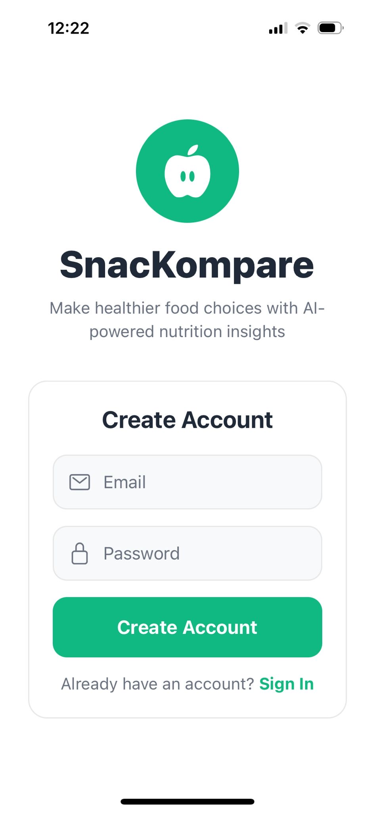

---

## 3. Onboarding (Initial Profile Setup)

Enter your information and complete the onboarding questions to build your nutrition profile.

- Provide your personal and dietary details as requested.
- Save onboarding to finish setup.

Your onboarding profile is used across the app and can be updated later in **Settings**.

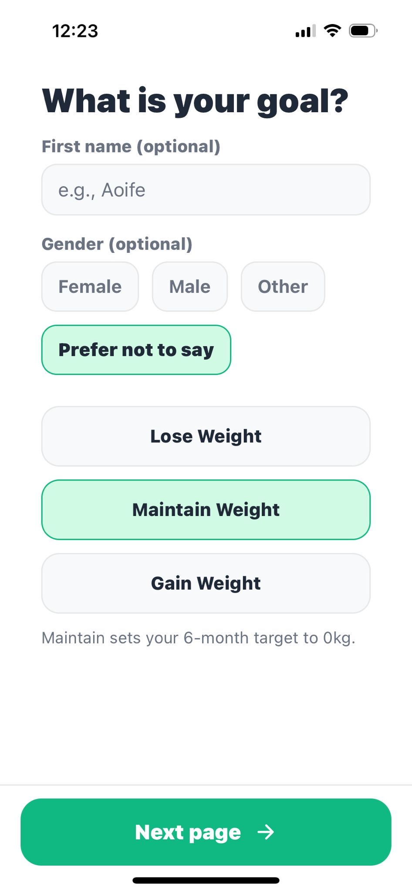
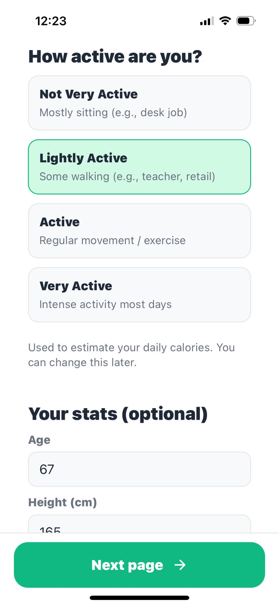
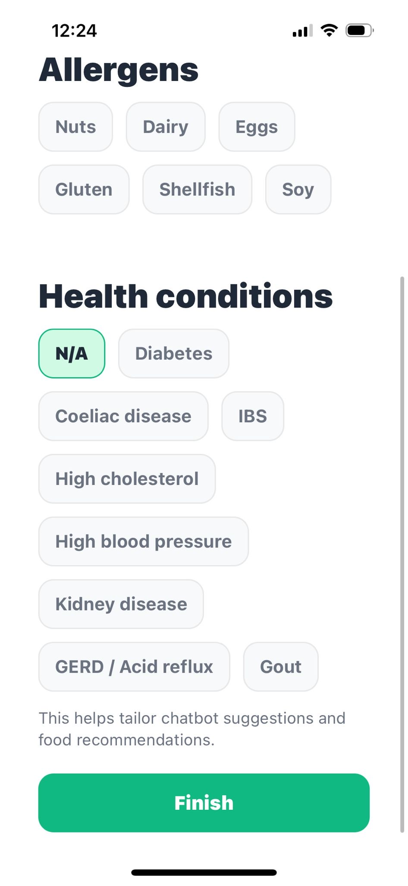

---

## 4. Home Page

The Home page is your main dashboard and includes:

- **Search** – Find foods quickly with manual search.
- **Barcode Scanner** – Scan packaged food barcodes.
- **Favourites** – Allows quick access to saved foods.

You can add items to favourites from:

- Search results
- Barcode scanner results

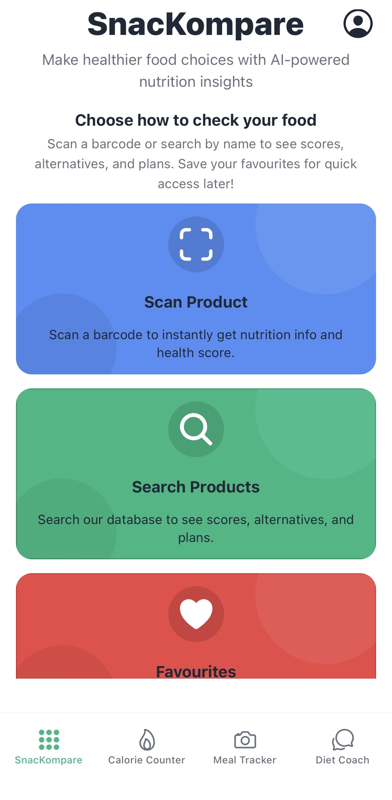

---

## 5. Search and Comparison Feature

Once a user presses on the search button, they can search for any product that they want. At first 10 results appear at a time, and users can scroll down and press on the load more button to return more results. If a user presses on an item they see:

- A product modal with nutritional information
- A health score based on European Nutri-Score
- Possible allergens
- Healthier alternatives listed at the bottom with higher health scores (up to 3)

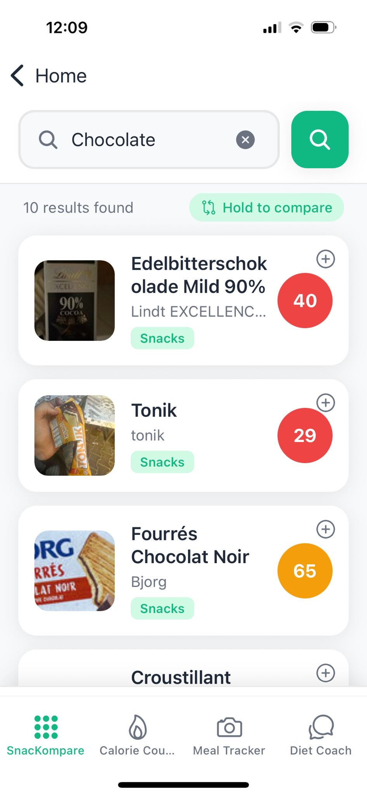
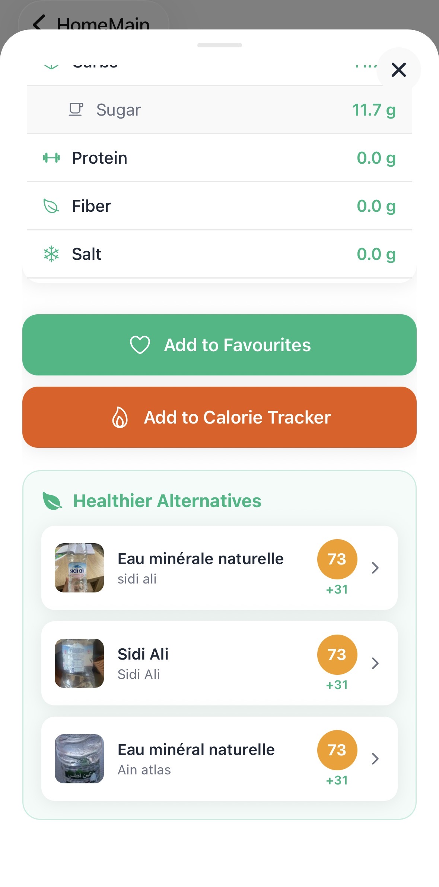

There's also a comparison feature which allows users to select 2 products and see a comprehensive AI comparison between them, and get a recommendation out of the two.

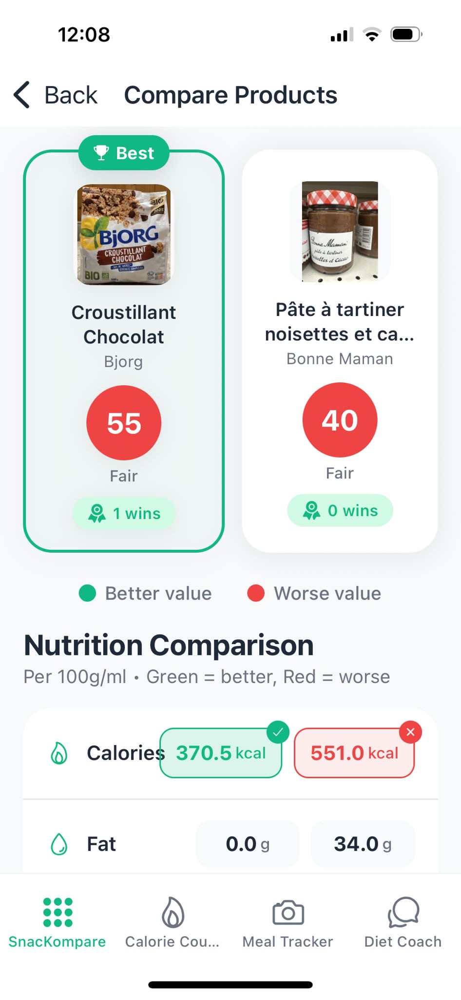

---

## 6. Barcode Scanning Feature

Once a user presses on the barcode scanning button on the home page, they can hold up a barcode in front of the scanner. If the barcode is recognised:

- A product modal is returned with nutritional information
- A health score is returned based on European Nutri-Score
- Possible allergens

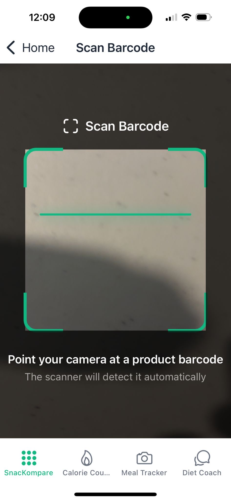

---

## 7. Meal Tracker

Use this feature to log meals from images.

1. Open the meal tracker page.
2. Take a photo of your meal.
3. Review the detected food item(s).
4. Adjust the grams or portion size of each item if needed.
5. Add the result to calorie tracking page if desired.

Each item will appear individually on the calorie counter page, where you can choose to keep or delete entries.

---

## 8. Calorie Counter

The Calorie Counter page tracks intake and supports multiple add methods.

You can add food entries:

- From the Search page
- From the Meal Tracker page
- Manually by entering the food item and calorie details

Use this page to monitor daily totals and maintain a consistent log.

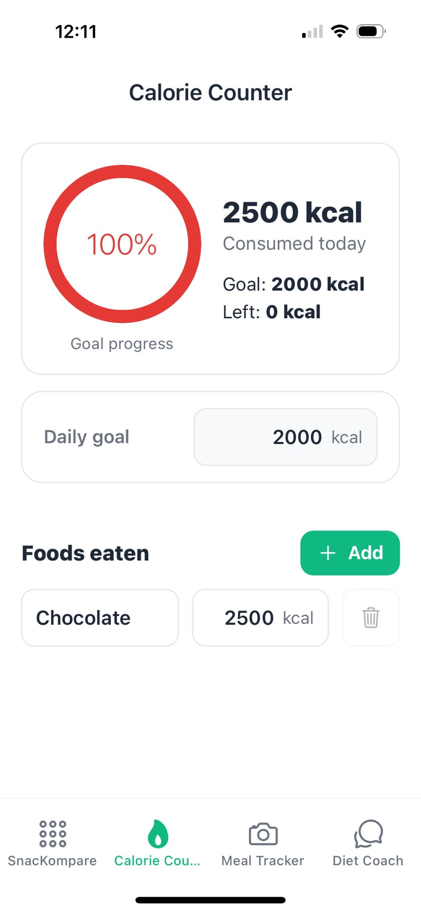

---

## 9. Profile and Settings

Your profile can be edited at any time.

1. Click on the profile button in the top right corner of the home screen.
2. Update your details (the same type of information set during onboarding).
3. Tap **Save** to apply changes.

Saved changes update personalisation throughout the app.

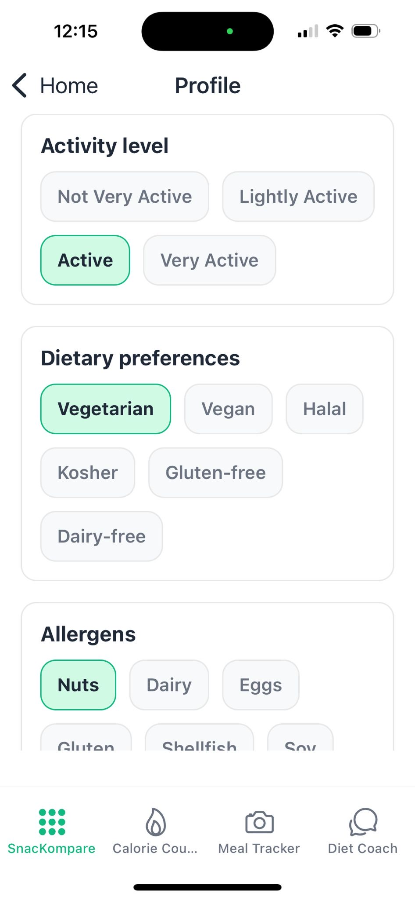

---

## 10. Diet Coach

The chatbot supports nutrition guidance and planning.

You can ask for:

- Dietary advice
- Meal suggestions
- Meal plans based on your goals

The chatbot uses your saved profile to tailor responses. It takes into account:

- Gender
- Age and height (if provided)
- Goals
- Health conditions
- Allergens
- Dietary preferences
- Activity levels

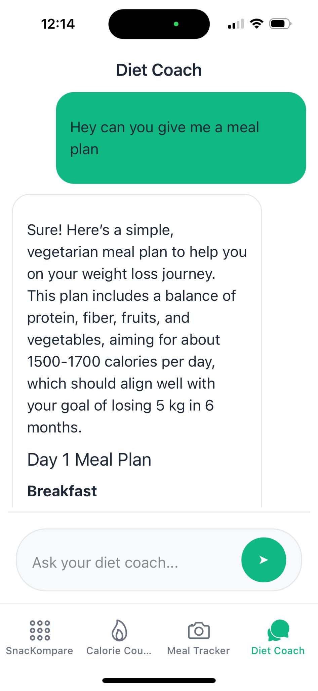

